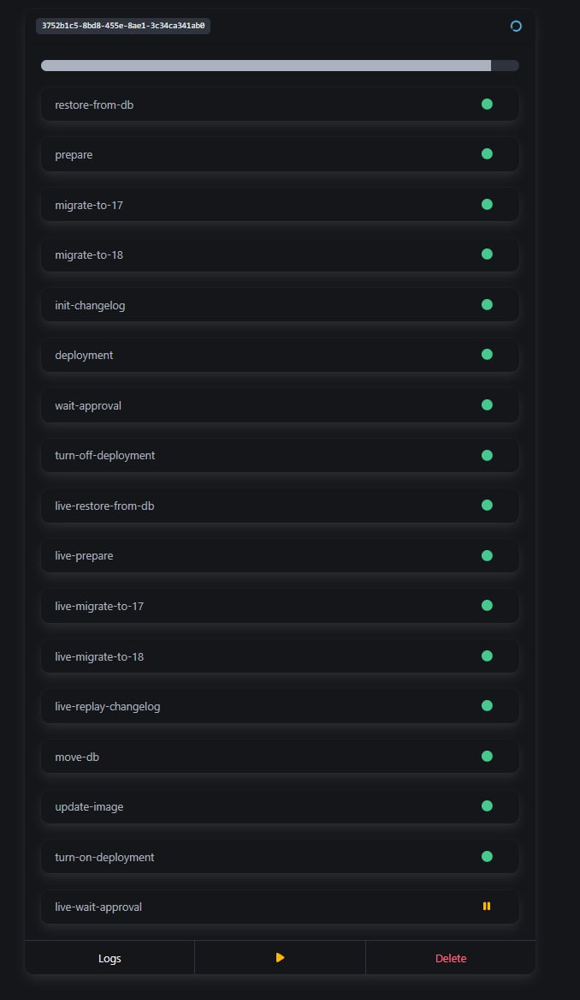
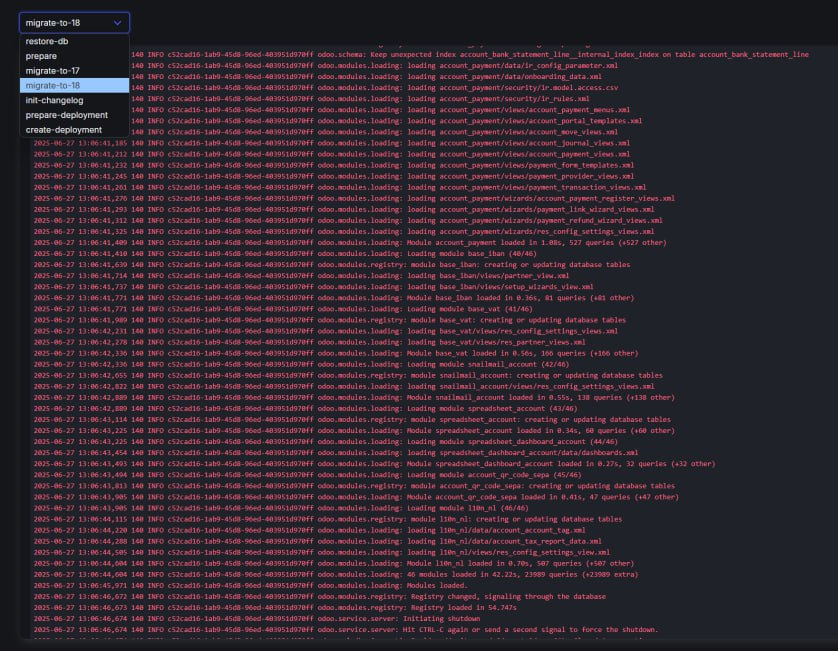

# odoo-upgrader

Odoo Upgrader is a tool for end-to-end upgrades from one Odoo major version to another. It leverages [OpenUpgrade](https://github.com/OCA/OpenUpgrade) and allows for full customization of the upgrade process. 

**Features:**
- Declarative upgrade paths
- Support for manual intervention
- Upgrade from file or target (running Odoo instance)
- Replay manual changes (website pages and blog posts)
- Web UI (/ui)
- REST API with interactive documentation (/docs)

  

## Setup

### Prerequisites

* Kubernetes cluster
* [Argo Workflows](https://argoproj.github.io/workflows)
* A S3 Bucket (if you plan to upgrade from file)
* Configured artifact repository in Argo Workflows
* PostgreSQL database

A manifest is included to create the necessary roles and PostgreSQL database:

``` bash
# 1. Create roles and PostgreSQL database
kubectl apply -f setup.yaml -n odoo-upgrader
```

## Configuration

It's fully configurable using env variables.

`ODOO_UPGRADER_JOB_NAMESPACE`: Namespace to deploy workflows and deployments

`ODOO_UPGRADER_JOB_DOMAIN`: Used to configure ingress rule for a deployment (E.g.: *.upgrade.example.com*)

`ODOO_UPGRADER_UPGRADE_PATHS`: See [Upgrade paths](#upgrade-paths)

`ODOO_UPGRADER_JOB_ENV`: Environment variables applicable for all jobs

`ODOO_UPGRADER_JOB_SECRET_ENV`: Secret environment variables applicable for all jobs

`ODOO_UPGRADER_S3`: S3 credentials

### Example environment variables

Here you can find an example of available environment variables: [.env.example](.env.example)

## How it works

### Upgrade paths

An upgrade path consists of steps that define the workflow to successfully upgrade an Odoo database from one major version to another. There are several kinds of pre-defined steps:

* Upgrade step (fully [customizable](#customization))
* Manual approval step
* Restore from file / target
* Changelog initialization and replay
* Dispatch server-side command (functions prefixed by `_command_*` .e.g `_command_deploy`)

An upgrade step is fully customizable using a simple directory structure 

### Customization

An upgrade step is fully customizable using a simple directory structure.

`repos.yaml` (optional): Repositories to aggregate (to pull e.g. custom modules and upgrade scripts) see [acsone/git-aggregator](https://github.com/acsone/git-aggregator)

`requirements.txt` (optional): Additional pip requirements (besides the packages installed in the image)

`pre.sh` (optional): Script to run before the upgrade 

`run.sh` (optional): If present, overrides the normal upgrade process. See [app/manifests/generic/scripts/step.sh](app/manifests/generic/scripts/step.sh)

`post.sh` (optional): Script to run after the upgrade

`upgrade_scripts` (optional): Additional upgrade scripts that are not provided by the image 

**Typical repository structure:**

```
16.0 📁
├── repos.yaml
├── requirements.txt
├── pre.sh
├── run.sh
├── post.sh
17.0 📁
├── ...
18.0 📁
├── ...
├── upgrade_scripts 📁
```

### Common Scenarios

**Workflow #1:**
1. Upload DB
2. Run upgrades
3. Download upgraded DB
4. **Manually** restore it on your Odoo system

**Workflow #2 (fully automatic):**
1. Download DB from target
2. Run upgrades
3. Initialize changelog
4. Run Odoo to preview changes
5. Fix layout issues on website
6. Download DB from target
7. Run upgrades
8. Replay changelog
9. Replace database and update image in target

## Running locally

To run the application locally:

``` bash
uvicorn app.main:app --log-config log-config.yaml
```

## Running in docker

WIP

## Running in Kubernetes (helm chart)

WIP

## Roadmap

- Authentication
- User friendly UI to upload a database, seperation from the admin UI
- Implement concurrent job limit
- Retry from last checkpoint
- Download created artifacts directly using the UI
- Hyperlink to deployment on UI

## Known limitations

- Resubmitting workflows using argo workflows can lead to problems atm
- Only tested with Odoo 16+

## Contributing

We welcome pull requests!

## License

This project is licensed under the GNU General Public License v3.0.  
See the [LICENSE](./LICENSE) file for details.
